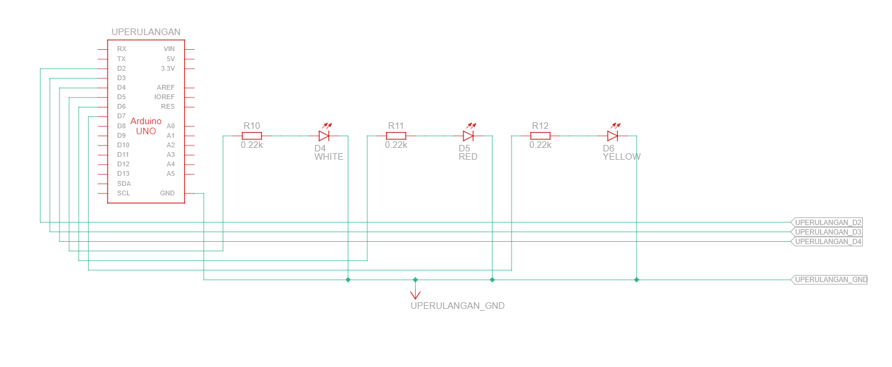
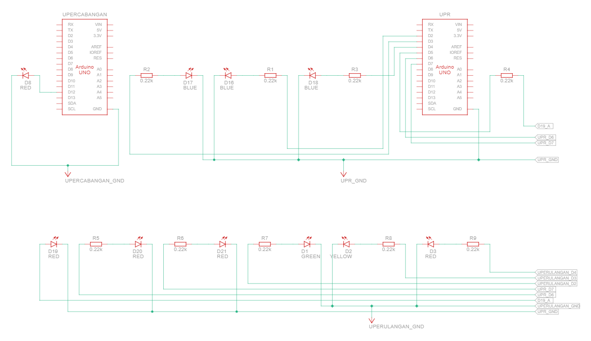
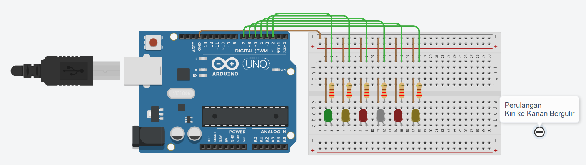
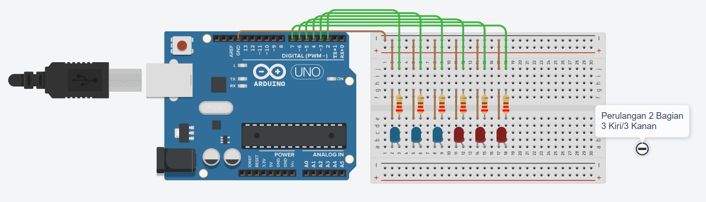
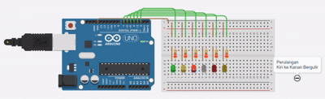
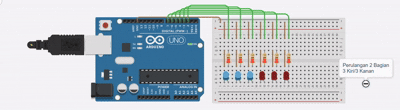

# Pertanyaan Perulangan

1. Gambarkan rangkaian schematic 5 LED running yang digunakan pada percobaan! 
2. Jelaskan bagaimana program membuat efek LED berjalan dari kiri ke kanan! 
3. Jelaskan bagaimana program membuat LED kembali dari kanan ke kiri! 
4. Buatkan program agar LED menyala tiga LED kanan dan tiga LED kiri secara bergantian dan berikan penjelasan disetiap baris kode nya dalam bentuk README.md!

<h1>Jawab</h1>

## 1. Gambaran Skematik LED running
### Tampilan Skema


### Tampilan Sirkuit


## 2. Menggunakan blok kode perulangan for dan inkremental:
``for (int ledPin = 2; ledPin < 9; ledPin++) {
  digitalWrite(ledPin, HIGH); 
  delay(timer); 
  digitalWrite(ledPin, LOW); 
}``
Program menetapkan variabel awal ledPin = 2. Ia akan menyalakan pin 2 (HIGH), menahannya selama waktu timer (100ms), lalu mematikannya (LOW). Setelah itu, ledPin++ akan menambah nilai pin menjadi 3. Proses yang sama diulang untuk pin 3, lalu pin 4, terus berlanjut hingga pin 8. Karena pin berurutan dari kiri ke kanan secara fisik di breadboard, mata kita menangkapnya sebagai cahaya yang "berjalan" ke arah kanan.

## 3. Menggunakan blok kode perulangan for dan dekremental:
``for (int ledPin = 8; ledPin >= 2; ledPin--) { 
  digitalWrite(ledPin, HIGH); 
  delay(timer); 
  digitalWrite(ledPin, LOW); 
}``
Setelah LED paling kanan (pin 8) mati pada program sebelumnya, perulangan ini mengambil alih. Ia memulai dari variabel tertinggi ledPin = 8. Ia menyalakan pin 8, menunggu, lalu mematikannya. Kemudian perintah ledPin-- akan mengurangi nilai pin menjadi 7. Proses menyala-mati ini berlanjut mundur ke pin 6, 5, dan seterusnya sampai kembali ke pin 2. Ini menciptakan ilusi optik LED berjalan kembali ke arah kiri.


## 4. Embedded Systems Programming: Alternating 3-LED Controller
Deskripsi Proyek
Program ini ditulis untuk mengontrol 6 buah LED yang terhubung ke Arduino Uno (Pin 2 hingga 7). Program akan membagi LED menjadi dua grup (3 LED Kiri dan 3 LED Kanan) dan menyalakannya secara bergantian layaknya lampu strobo atau sinyal peringatan.




### Skematik Pin
- **Grup Kiri:** Pin 2, 3, 4
- **Grup Kanan:** Pin 5, 6, 7
- **Ground:** Dihubungkan ke GND Arduino.


### Kode Program dan Penjelasan (Line-by-Line)

```cpp
// Mendeklarasikan variabel global 'timer' dengan tipe data integer.
// Nilai 500 berarti jeda waktu adalah 500 milidetik (0.5 detik).
int timer = 500; 

void setup() { 
  // Blok setup dijalankan satu kali saat Arduino pertama kali dihidupkan.
  
  // Menggunakan perulangan 'for' untuk efisiensi inisialisasi pin.
  // Mulai dari pin 2, selama pin kurang dari atau sama dengan 7, pin akan bertambah 1.
  for (int ledPin = 2; ledPin <= 7; ledPin++) { 
    // Mengatur setiap pin yang diiterasi (2,3,4,5,6,7) sebagai pin OUTPUT.
    pinMode(ledPin, OUTPUT); 
  } 
} 

void loop() { 
  // Blok loop akan terus berjalan berulang-ulang tanpa henti.

  // --- KONDISI 1: 3 LED Kiri Menyala, 3 LED Kanan Mati ---
  
  // Perulangan untuk menyalakan Grup Kiri (Pin 2, 3, 4)
  for (int i = 2; i <= 4; i++) {
    digitalWrite(i, HIGH); // Memberikan tegangan 5V ke pin i, LED menyala
  }
  
  // Perulangan untuk memastikan Grup Kanan mati (Pin 5, 6, 7)
  for (int i = 5; i <= 7; i++) {
    digitalWrite(i, LOW);  // Memutus tegangan (0V) ke pin i, LED mati
  }
  
  // Menahan kondisi 1 agar tetap aktif selama 500ms agar mata bisa melihatnya.
  delay(timer); 

  // --- KONDISI 2: 3 LED Kiri Mati, 3 LED Kanan Menyala ---
  
  // Perulangan untuk mematikan Grup Kiri (Pin 2, 3, 4)
  for (int i = 2; i <= 4; i++) {
    digitalWrite(i, LOW);  // Memutus tegangan (0V) ke pin i, LED mati
  }
  
  // Perulangan untuk menyalakan Grup Kanan (Pin 5, 6, 7)
  for (int i = 5; i <= 7; i++) {
    digitalWrite(i, HIGH); // Memberikan tegangan 5V ke pin i, LED menyala
  }
  
  // Menahan kondisi 2 agar tetap aktif selama 500ms sebelum program kembali ke awal loop.
  delay(timer); 
}
